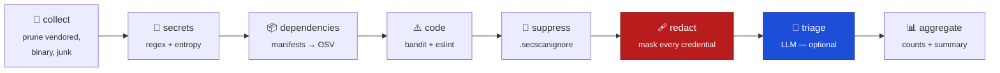

<div align="center">

# 🛡️ reposec

**Find exposed secrets, vulnerable dependencies, and unsafe code — before someone else does.**

Detection is done by *tools*, deterministically. An LLM, if you configure one, only judges what they found.

[](https://github.com/toosh-legacy/github-py-review/actions/workflows/ci.yml)
[](#run-it-locally)
[](#development)
[](LICENSE)

```bash
git clone https://github.com/toosh-legacy/github-py-review.git
cd github-py-review && pip install -e .
reposec scan .
```

> **Not published yet.** There is no PyPI package and no public container image
> — run it from a clone, as above. [Setup in full →](#run-it-locally) ·
> [publishing, when we get there →](docs/RELEASE.md)

📖 **[Full CLI manual →](docs/CLI.md)**&nbsp;&nbsp;·&nbsp;&nbsp;🏗️ **[Codebase tour →](docs/GUIDE.md)**&nbsp;&nbsp;·&nbsp;&nbsp;🚀 **[Release process →](docs/RELEASE.md)**

</div>

---

## What it does

Three detectors, each answering a question that has a *right answer*.

| | Detector | Finds | How |
|---|---|---|---|
| 🔑 | **Secrets** | AWS keys, private keys, GitHub/Stripe/Slack/OpenAI tokens, database URLs with live passwords, and generic high-entropy credentials | ~25 gitleaks-derived regex fingerprints + Shannon entropy — in the working tree **and in git history** |
| 📦 | **Dependencies** | Packages with published CVEs | `requirements.txt`, `pyproject.toml`, `Pipfile.lock`, `package.json`, `package-lock.json`, `yarn.lock` → resolved versions checked against **OSV** (GHSA + PySec + CVE) |
| ⚠️ | **Unsafe code** | Command injection, SQL built by concatenation, `eval`, unsafe deserialization, broken crypto, disabled TLS verification, XSS sinks | **bandit** (Python) and **eslint-plugin-security** (JS/TS), plus pattern rules for the sinks eslint has no rules for |

It runs **fully offline**. Nothing leaves your machine except package names and versions sent to OSV — and `--offline` stops that too.

### Measured, not asserted

| | |
|---|---|
| **Recall on real code** | **16/16** synthetic credentials and unsafe patterns planted in a real application |
| **False positives** | **0** blocking secret findings across 570 kLOC of `requests`, `flask`, `axios` and 1,500 installed packages |
| **Labelled benchmark** | P **0.96** · R **1.00** · F1 **0.98** over 111 cases — *half of them decoys* |
| **Noise** | 0.23 code findings per kLOC · **65%** of raw bandit output filtered as unactionable |
| **Speed** | 11.1 kLOC/s end to end with real analyzers; linear to 4,000+ files |

Every number is reproducible: `python src/evaluation/run_live_eval.py`. See [Benchmarks](#benchmarks).

---

## How it does it

### Tools decide. The model judges.

Most "AI security scanners" ask a model to *find* vulnerabilities. That gets you hallucinated findings and silent misses, with no way to tell which is which.

Whether a string is an AWS key, whether `flask==0.12.2` has a CVE, whether a line concatenates user input into SQL — these are **decidable**. So a rule decides them, the same way every time, and you can argue with the rule.

The model does only the part rules genuinely cannot: collapsing duplicates, judging exploitability *in this codebase*, explaining risk in plain language, writing the fix.

> **It cannot create a finding, move one, or change which rule fired.** Replies are matched back to detector output by id; anything unrecognised is discarded. That is enforced in code, not requested in a prompt.

**No model is required.** Run with none and detection is byte-identical — you get rule-authored explanations instead of model-written ones.

### Staying quiet is the hard part

Detection is easy. Any regex finds `AKIA…`. What decides whether a scanner stays installed is what it says about the other 400,000 lines.

Three layers do that work, and each exists because of a measurement:

- **Placeholder suppression** — `.env.example`, `${TEMPLATE}`, `<your-key>`, AWS's own documented sample key.
- **Context downgrades** — documentation and test trees *downgrade* entropy-gated rules rather than dropping them. A provider fingerprint is untouched: an `AKIA…` in a test file is a live AWS key.
- **Measured skip lists** — `B101`, `B603`, `B607` and the `B4xx` import advisories fire on ubiquitous *correct* code. On 420 kLOC of real packages they were over half of all output, none actionable.

Half the benchmark fixture is decoys, for exactly this reason. **A scanner that fires on everything has perfect recall and is worthless.**

### It never lies about coverage

A scanner that quietly covers half of what you think it does is worse than one that refuses to start. So every bound is *counted and reported*:

- a missing analyzer → a degraded note, never a clean result
- an analyzer timeout → costs one chunk, and names how many files were in it
- a cap, budget, or truncation → says how much went unscanned
- `--strict` → turns any of the above into a distinct exit code

---

## Architecture



Eight stages, run in order by a `for` loop. There is **no orchestration framework** — there was one, and [`docs/GUIDE.md`](docs/GUIDE.md) explains why removing it deleted a vulnerability class and 1.3 seconds of startup.

**The order is the security guarantee.** `redact` sits between detection and triage because bandit's `B105` quotes the offending source line verbatim — without it, a live token would reach the report, the terminal, *and* the model prompt. That ordering is asserted by a test, not documented and hoped for.

### The authorization boundary

`tests/test_pipeline_safety.py` proves, mechanically, that the pipeline:

- ✅ cannot write, post, merge, or modify anything — it returns a report and nothing else
- ✅ cannot fetch: files arrive as an argument, so it has no network reach into your repositories
- ✅ cannot shell out from the pipeline module
- ✅ has no detection stage that references a model
- ✅ imports nothing that would trace your source to a third party

### Module map

| Path | What it is |
|---|---|
| `reposec/pipeline.py` | The eight stages and the loop that runs them |
| `reposec/detectors/rules.py` | The secret rule table — fingerprint and entropy-gated |
| `reposec/detectors/secrets.py` | Detector 1, plus `scrub()`, the redaction every output path uses |
| `reposec/detectors/deps.py` · `osv.py` | Detector 2 — manifest parsing and the OSV client |
| `reposec/detectors/code.py` | Detector 3 — chunked bandit and eslint subprocesses |
| `reposec/detectors/history.py` | The same secret rules, walked over git history |
| `reposec/triage.py` · `llm.py` | The LLM stage and the swappable backend seam |
| `reposec/cli.py` | The command, output formats, and the exit-code contract |
| `apps/extension/` | The zero-backend browser scanner |
| `evaluation/` | Four measurement harnesses (see below) |

### Two implementations, kept honest

The browser extension is a second implementation of the secret rules in JavaScript. Its **rule table is generated** from `rules.py`, and `tests/js/parity.test.mjs` scores it against the *same labelled benchmark* the Python detector is scored against — not merely diffing regexes, because the drift that matters is in suppression logic, not in the patterns.

---

## Run it locally

There is no published package yet, so everything below runs from a clone. It
takes about two minutes.

**You need:** Python **3.12 or 3.13**, `git`, and — only for scanning
JavaScript/TypeScript — **Node.js 18+** with npm.

### 1. Clone and install

<table>
<tr><th align="left">macOS / Linux</th><th align="left">Windows (PowerShell)</th></tr>
<tr valign="top"><td>

```bash
git clone https://github.com/toosh-legacy/github-py-review.git
cd github-py-review

python3 -m venv .venv
source .venv/bin/activate

pip install -e .
```

</td><td>

```powershell
git clone https://github.com/toosh-legacy/github-py-review.git
cd github-py-review

py -3.13 -m venv .venv
.\.venv\Scripts\Activate.ps1

pip install -e .
```

</td></tr>
</table>

`-e` is an *editable* install: the `reposec` command runs the code in your
working tree, so edits take effect with no reinstall.

Want the optional LLM triage stage too? `pip install -e ".[llm]"`.

### 2. Add the JavaScript detector (optional)

Python scanning works immediately. JS/TS needs Node:

```bash
reposec install-eslint
```

Skip it and JS files still get pattern-rule coverage — the scan will say so
rather than reporting a clean result it did not earn.

### 3. Check what actually works on your machine

```bash
reposec doctor
```

```console
  [ok  ] secrets                built in — regex fingerprints + entropy
  [ok  ] dependencies           OSV over HTTPS (package names only)
  [ok  ] code (python)          bandit
  [ok  ] code (js/ts)           eslint-plugin-security
  [MISS] triage (llm)           no model configured — triage skipped
```

`[MISS] triage (llm)` is expected and fine — detection is identical without a
model. Run this first on any new machine: a scanner that quietly covers half of
what you think it does is the failure this command exists to prevent.

### 4. Scan something

```bash
reposec scan .                     # this repository
reposec scan ../my-project         # any other checkout
reposec scan . --history           # + git history — finds deleted secrets
reposec scan . --fail-on high      # exit 1, for a CI gate
reposec scan . --format json       # machine-readable
```

No install at all? `python -m reposec scan .` works from the repo root with the
dependencies installed.

**→ [The full CLI manual](docs/CLI.md)** covers every command, flag, exit code,
output format, `.secscanignore`, configuration, CI recipes, and troubleshooting.

### Run it via Docker instead

Build the image yourself — none is published:

```bash
docker build -f deploy/Dockerfile -t reposec:local .

docker run --rm -v "$PWD:/repo:ro" reposec:local scan /repo --history
```

Read-only mount, because the scanner never writes to your repository. The image
ships its own detectors and **fails to build** if bandit, eslint, node, git or
OSV cannot run inside it — so a green build is a working scanner, not just
present files.

> On Windows PowerShell use `-v "${PWD}:/repo:ro"`; in Git Bash prefix the
> command with `MSYS_NO_PATHCONV=1` or it will rewrite `/repo` into a Windows
> path.

### Troubleshooting a fresh clone

| Symptom | Fix |
|---|---|
| `reposec: command not found` | The venv is not active. Re-run the activate line, or use `python -m reposec`. |
| `doctor` shows `code (js/ts)` missing | `reposec install-eslint`. Needs Node and npm on PATH. |
| `install-eslint` used `--dir` | Export `REPOSEC_ESLINT_DIR=<that directory>` — the command prints the exact line. |
| `--history` found nothing | You need real history. A shallow clone has none to walk. |
| Every dependency says "unresolved" | Your manifest declares ranges, not pins. Commit a lockfile; the scanner reports rather than guessing. |
| `ScriptBlock` / activation error on Windows | `Set-ExecutionPolicy -Scope Process -ExecutionPolicy Bypass`, then activate again. |

### Publishing

Nothing is published yet — no PyPI package, no public image, no Web Store
listing. When that changes, [`docs/RELEASE.md`](docs/RELEASE.md) is the full
process: what to bump, how the tag drives the three artifacts, and the one-time
PyPI and GHCR setup it needs first.

---

## Browser extension

For repositories you have not cloned and may never clone: vetting a dependency, reviewing someone else's project, due diligence.

Load `src/apps/extension/` at `chrome://extensions` (Developer mode → *Load unpacked*), open any GitHub repository, click **🛡️ Scan for secrets**.

**It has no backend.** The rules run in a service worker; OSV is a public HTTPS API. Your source is never uploaded. The only requests are to `api.github.com` (read files) and `api.osv.dev` (package names and versions — never code).

The third detector is honestly missing: bandit and eslint are subprocesses over a directory tree and cannot run in a browser. Every scan says so, rather than presenting two thirds of a scan as a clean result.

---

## Benchmarks

Four harnesses, because each answers a question the others structurally cannot.

```bash
python src/evaluation/run_security_eval.py   # labelled fixture — regression
python src/evaluation/run_fp_eval.py         # installed packages — noise
python src/evaluation/run_live_eval.py       # real repositories — recall + noise
python src/evaluation/run_perf_bench.py      # throughput and scaling
```

### 1. Labelled benchmark — 111 cases

| Detector | Precision | Recall | F1 |
|---|---|---|---|
| Secrets | 1.00 | 1.00 | 1.00 |
| Dependencies | 1.00 | 1.00 | 1.00 |
| Code | 0.92 | 1.00 | 0.96 |
| **Overall** | **0.96** | **1.00** | **0.98** |

Overall precision is deliberately **not** 1.00. Two decoys fire from eslint-plugin-security's own conservatism — a filename checked against a regex on the line above, and a bounded `{0,3}` quantifier it calls unsafe. Suppressing them means suppressing the upstream rule everywhere, so they are recorded as known failures instead of hidden.

Dependencies score against a frozen OSV snapshot, or a newly published advisory upstream would be indistinguishable from a regression here.

> **What it proves and doesn't.** The fixture was written alongside the scanner, so green means *no regression*, not *solved*. It earned its keep anyway: building it found three bandit rules that fire on correct code, and a newline bug that made bandit fail to parse every Python file on Windows.

### 2. Live fire — real repositories

This is the honest number. It clones real applications, plants a known set of credentials and unsafe patterns into one, and scores the scan against that list — on code nobody here wrote.

| Phase | Result |
|---|---|
| **Recall** | 16/16 planted findings caught — **1.00** |
| **Noise** | **0** blocking secret false positives over 150.5 kLOC of `requests` + `flask` + `axios` |
| **Signal** | 203 findings on `pygoat`, 245 on `dvpwa`, 18 on `nodegoat` — all deliberately vulnerable |
| **vs. raw bandit** | 65% of bandit's output filtered as unactionable |
| **Speed** | 94 kLOC in 8.5s end to end, real analyzers included |

It has already earned its place: on its first run it found five `high` false positives on `psf/requests` and `axios`, and a bug where a real AWS key containing a `/` was neither reported nor *redacted*.

### 3. Noise on installed packages

**0 secret false positives over 419.6 kLOC**, 0.23 code findings per kLOC. Any secret hit counts as a false positive — a published package does not contain a live credential.

### 4. Speed

~4,300 files/s to walk a tree, ~56 kLOC/s on the pure-Python path, growth factor **1.01** from 250 to 4,000 files. The analyzers are ~95% of wall time: tuning a regex saves nothing, a wasted bandit invocation costs seconds.

Budgets for all of this are enforced as tests: `pytest -m quality`.

### Not yet measured: triage lift

`--triage` reports what the LLM stage changed — findings merged, severities moved, precision@5 before and after, token cost. **Those numbers do not exist**, because no model has been benchmarked; with none configured the run reports zeroes and says so. It is the one part of this tool whose value is asserted rather than measured.

The triage *path* is tested, against a stand-in reproducing how small models actually fail: skipped ids, shouty `"HIGH"` severities, invented ids, reciprocal duplicate claims, outright errors.

---

## Development

```bash
pip install -r requirements-dev.txt && pip install -e .
reposec install-eslint

ruff check . && pytest -m "not quality" && node --test tests/js/parity.test.mjs
pytest -m quality                            # precision and speed budgets, slow
reposec scan . --history --fail-on high      # what CI gates on
```

307 tests, 88% coverage. [`CONTRIBUTING.md`](CONTRIBUTING.md) has the rules — the short version is that **a new detector rule needs a decoy as well as a planted case**, because precision is the binding constraint. [`docs/GUIDE.md`](docs/GUIDE.md) is a guided tour of the codebase; [`docs/PRODUCTION_READINESS.md`](docs/PRODUCTION_READINESS.md) is the live worklist of what is done, what is unproven, and what is known-broken and accepted.

## Security

[`SECURITY.md`](SECURITY.md) covers how to report a vulnerability, and what the scanner does with your code.

The scanner runs on its own repository in CI and blocks on a high-severity finding. That has caught three high CVEs in its own dependencies and a ReDoS in its own manifest parser.

## License

MIT — see [`LICENSE`](LICENSE).
